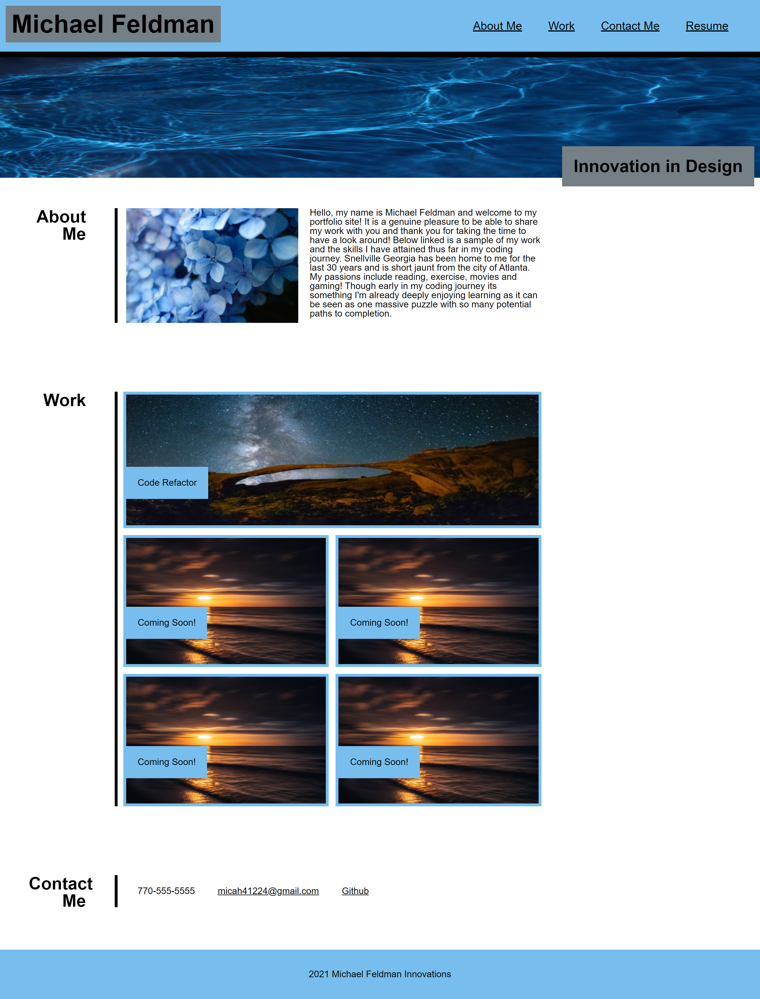

# 02-Advanced-CSS-Homework

Week Two Homework: Advanced CSS Porfolio Page

## Project Description

The main objective of this project is to create an aesthetically pleasing, fully functional and responsive portfolio page. This page is to be used to showcase my completed projects as I create them over the duration of this course and beyond. This page includes my name and a recent picture of me. There is an about me section as well as a section with links to my various completed projects as well as a section including contact information. The nav bar for this page brings you down to each listed section and includes a link to my resume (not yet posted but will be soon). The project links are done as labeled images and the first project's image is larger than the rest which follow a 2 column format when loaded into a browser of standard size. Several of the links will be empty and read as "coming soon" upon the initial deployment of this site but will be filled in with my projects as I create them. This page has been made responsive so that it can be viewed on a wide variety of devices as cleanly as possible.

## Link to application on Github:

https://github.com/micah41224/02-Advanced-CSS-Homework

## Link to deployed application:

https://micah41224.github.io/02-Advanced-CSS-Homework/

## Screenshots

